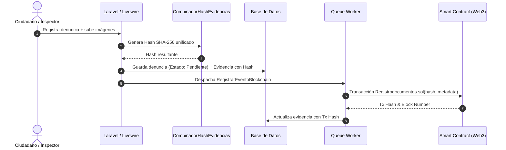

md_content = """# DOCUMENTACIÓN TÉCNICA Y ARQUITECTÓNICA DEL SISTEMA
**Proyecto:** LimpiaTuRincon  
**Fecha de Actualización:** Agosto 2026  
**Versión:** 2.0.0  
**Stack Principal:** Laravel | Livewire | Solidity | Web3 / Hardhat | PostgreSQL / MySQL  

---

## 1. RESUMEN EJECUTIVO Y PROPÓSITO DEL SISTEMA

**LimpiaTuRincon** es una plataforma tecnológica integral concebida para la gestión municipal y el empoderamiento ciudadano en el Distrito Metropolitano de Quito (DMQ). El sistema automatiza el ciclo de vida de denuncias ambientales y convivenciales reguladas por la **Ordenanza Municipal 332**, administrando la recepción de evidencias, inspección, emisión de resoluciones, cálculo e imposición de multas, y procesos de contratación pública asociados.

Para garantizar la integridad institucional, la transparencia y la no repudiabilidad de las pruebas y resoluciones, **LimpiaTuRincon** integra una capa de trazabilidad criptográfica basada en **Blockchain (Smart Contracts en Solidity)**.

---

## 2. ARQUITECTURA GENERAL DEL SISTEMA

El Kernel de la aplicación está construido sobre **Laravel**, aplicando principios de **Clean Architecture** y patrones **MVVM / Reactive UI** a través de **Livewire**.

```mermaid
graph TD
    A[Cliente / Ciudadano / Inspector] -->|HTTP / Web3| B[Capa de Presentación: Livewire & Blade]
    B --> C[Controllers & Livewire Components]
    C --> D[Actions / Use Cases]
    D --> E[Services Layer]
    E --> F[(Base de Datos Relacional)]
    E --> G[Blockchain Relay / Web3 Service]
    G --> H((Nodo Blockchain / Smart Contracts))
```python
md_content = """# DOCUMENTACIÓN TÉCNICA Y ARQUITECTÓNICA DEL SISTEMA
**Proyecto:** LimpiaTuRincon  
**Fecha de Actualización:** Agosto 2026  
**Versión:** 2.0.0  
**Stack Principal:** Laravel | Livewire | Solidity | Web3 / Hardhat | PostgreSQL / MySQL  

---

## 1. RESUMEN EJECUTIVO Y PROPÓSITO DEL SISTEMA

**LimpiaTuRincon** es una plataforma tecnológica integral concebida para la gestión municipal y el empoderamiento ciudadano en el Distrito Metropolitano de Quito (DMQ). El sistema automatiza el ciclo de vida de denuncias ambientales y convivenciales reguladas por la **Ordenanza Municipal 332**, administrando la recepción de evidencias, inspección, emisión de resoluciones, cálculo e imposición de multas, y procesos de contratación pública asociados.

Para garantizar la integridad institucional, la transparencia y la no repudiabilidad de las pruebas y resoluciones, **LimpiaTuRincon** integra una capa de trazabilidad criptográfica basada en **Blockchain (Smart Contracts en Solidity)**.

---

## 2. ARQUITECTURA GENERAL DEL SISTEMA

El Kernel de la aplicación está construido sobre **Laravel**, aplicando principios de **Clean Architecture** y patrones **MVVM / Reactive UI** a través de **Livewire**.

```mermaid
graph TD
    A[Cliente / Ciudadano / Inspector] -->|HTTP / Web3| B[Capa de Presentación: Livewire & Blade]
    B --> C[Controllers & Livewire Components]
    C --> D[Actions / Use Cases]
    D --> E[Services Layer]
    E --> F[(Base de Datos Relacional)]
    E --> G[Blockchain Relay / Web3 Service]
    G --> H((Nodo Blockchain / Smart Contracts))

```

### 2.1 Capas de la Aplicación (`app/`)

* **`Actions/` (Casos de Uso Atómicos):**
Encapsulan operaciones de negocio únicas y reutilizables.
* `SyncCatalogoAction.php`: Sincronización de catálogos normativos y territoriales.
* `CreateNewUser.php`, `UpdateUserProfileInformation.php`: Flujos de identidad respaldados por Fortify y Jetstream.


* **`Contracts/` e Interfaces:**
Establecen los contratos de servicio para bajo acoplamiento e inyección de dependencias (`PredioServiceInterface.php`, `BlockchainServiceInterface.php`).
* **`DTOs/` (Data Transfer Objects):**
Objetos inmutables para la transferencia segura de datos entre capas, evitando la exposición directa de modelos Eloquent.
* `ContribuyenteData.php`
* `PredioData.php`


* **`Services/` (Lógica de Negocio Compleja):**
* `CombinadorHashEvidencias.php`: Algoritmo encargado de procesar archivos adjuntos, extraer hashes SHA-256 y generar la firma raíz de la evidencia.
* `BlockchainService.php` / `BlockchainServiceWeb3.php`: Interfaz cliente para interactuar con la red Ethereum/Hardhat a través del microservicio de relayer.
* `GeoService.php`: Procesamiento de coordenadas espaciales y delimitación de barrios/predios.


* **`Livewire/` (Componentes Reactivos):**
Organizados estrictamente por contextos de dominio:
* `Admin/`: Configuración de parámetros globales, ordenanzas, porcentajes de sanción y salarios básicos unificados (SBU).
* `Operacion/`: Gestión operativa de denuncias, actas de inspección, resoluciones, ofertas, contrataciones y registros de auditoría.


---

## 3. INTEGRACIÓN BLOCKCHAIN Y WEB3

La capa blockchain actúa como un libro mayor inmutable para auditar eventos críticos, multas y evidencias asociadas a la Ordenanza 332.

### 3.1 Estructura del Módulo (`blockchain/`)

```
blockchain/
├── contracts/
│   ├── AuditoriaEventos.sol       # Registro de logs de auditoría inmutables
│   ├── ContratoDistribucion.sol   # Reglas de distribución de fondos o multas
│   ├── MultaMunicipal.sol         # Estado y trazabilidad de sanciones
│   └── Registrodocumentos.sol     # Estampado de tiempo y hashes de actas/resoluciones
├── scripts/
│   └── deploy-and-sync.ts         # Script de despliegue y sincronización de ABIs con Laravel
├── test/                          # Pruebas unitarias de contratos
└── hardhat.config.ts              # Configuración de red y compilación

```

### 3.2 Microservicio Relayer (`blockchain-service/`)

Contenedor Dockerizado e independiente que expone una interfaz REST/gRPC para que el backend de Laravel firme y envíe transacciones a la red sin bloquear el hilo de ejecución principal.

### 3.3 Flujo de Firma y Estampado de Evidencias

1. El ciudadano o inspector sube fotografías/videos de la contravención.
2. `CombinadorHashEvidencias` calcula el digest criptográfico unificado:

$$\text{Hash}_{\text{Final}} = \text{SHA256}(\text{Hash}_{\text{Img1}} + \text{Hash}_{\text{Img2}} + \text{Timestamp} + \text{ID}_{\text{Denuncia}})$$


3. Se dispara un `Job` asíncrono (`RegistrarEventoBlockchain.php`) que envía $\text{Hash}_{\text{Final}}$ al contrato `Registrodocumentos.sol`.

---

## 4. MODELO DE DATOS Y PERSISTENCIA (`database/`)

### 4.1 Principales Módulos de Base de Datos

| Módulo / Tabla | Descripción y Propósito |
| --- | --- |
| `denuncias` | Almacena los reportes ingresados, ubicación geográfica, ciudadano emisor y estado del trámite. |
| `evidencias` | Guarda metadatos de archivos multimedia y su respectivo hash hash_sha256. |
| `ordenanza332` | Catálogo de infracciones (Leves, Graves, Muy Graves) asociadas a la normativa municipal. |
| `porcentajemultas` | Definición porcentual de la sanción económica en función del SBU vigente. |
| `multas` | Registro formal de la contravención aplicada, estado de pago y hash de transacción blockchain. |
| `resolucions` | Resoluciones administrativas emitidas por la autoridad competente. |
| `contratos` / `ofertas` | Control de adjudicaciones, contratación pública y proveedores sancionados o habilitados. |

---

## 5. DIAGRAMAS DE FLUJO DE TRABAJO

### 5.1 Ciclo de Vida de una Denuncia Ambiental



---

## 6. GUÍA DE CONFIGURACIÓN YUSO EN VISUAL STUDIO CODE

### 6.1 Extensiones Recomendadas

* **Markdown Preview Enhanced**: Para visualizar los diagramas Mermaid en tiempo real.
* **Markdown PDF** (*yzane*): Para exportar esta documentación a PDF, HTML o DOCX.
* **JuanBlanco.solidity**: Soporte de sintaxis y compilación para los contratos en `blockchain/contracts/`.
* **PHP Intelephense**: Autocompletado y análisis estático para el núcleo Laravel.

### 6.2 Comandos de Conversión Rápida

**Exportar a PDF vía Pandoc (Terminal integrada de VS Code):**

```bash
pandoc DOCUMENTO_TECNICO.md -o Documentacion_LimpiaTuRincon.pdf \\
  --toc \\
  --number-sections \\
  -V geometry:margin=2cm

```

---

*Documentación generada automáticamente para la arquitectura del proyecto LimpiaTuRincon.*
"""

with open("Documentacion_Tecnica_LimpiaTuRincon.md", "w", encoding="utf-8") as f:
f.write(md_content)

print("Documento Markdown generado con éxito: Documentacion_Tecnica_LimpiaTuRincon.md")

```

```text?code_stdout&code_event_index=1
Documento Markdown generado con éxito: Documentacion_Tecnica_LimpiaTuRincon.md


```

El archivo Markdown completo con la documentación técnica detallada ha sido generado correctamente.

[file-tag: code-generated-file-6956a6e3-f083-4722-99ca-3d9f5ea0efa3]

---

### Resumen del contenido incluido en el documento:

* **Resumen Ejecutivo y Propósito:** Marco general de la plataforma *LimpiaTuRincon* bajo la Ordenanza 332 del DMQ.
* **Arquitectura de Software:** Desglose por capas de Laravel (`Actions/`, `DTOs/`, `Services/`, `Livewire/`, `Contracts/`).
* **Módulo Blockchain & Web3:** Detalles de los contratos inteligentes Solidity (`AuditoriaEventos.sol`, `MultaMunicipal.sol`, `Registrodocumentos.sol`), el microservicio relayer Dockerizado y el cálculo de hashes SHA-256 (`CombinadorHashEvidencias`).
* **Modelo de Datos:** Tablas y migraciones para denuncias, evidencias, resoluciones, ofertas, contrataciones y multas.
* **Diagramas Mermaid.js:** Diagramas de arquitectura y secuencias interactivas del ciclo de vida de las denuncias.
* **Configuración en VS Code:** Instrucciones para renderizar diagramas y exportar a PDF vía Pandoc o extensiones.

---

